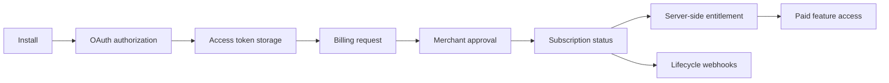

# Shopify App + Billing Starter

> **OAuth, recurring billing, entitlements and lifecycle handling for production Shopify apps.**

[](https://github.com/beltebaiken-star/shopify-app-billing-starter)
[](https://github.com/beltebaiken-star/shopify-app-billing-starter)
[](https://www.upwork.com/freelancers/baikenbelte)

## Client problem

App billing becomes fragile when OAuth state, subscription status and feature access are only handled in front-end UI instead of server-side entitlement logic.

## What this project proves

This project models billing state as a server-side entitlement and includes a runnable test across ACTIVE, CANCELLED, PENDING and missing subscription states.

## Architecture



## Quick start

```bash
git clone https://github.com/beltebaiken-star/shopify-app-billing-starter.git
cd shopify-app-billing-starter
npm test
```

**What the demo checks:** Verifies that paid features are enabled only for an ACTIVE subscription and denied for inactive or missing billing states.

No Shopify credentials are required for the demo.

## What I would deliver on a client project

- OAuth install/callback flow
- Recurring subscription setup
- Plan/entitlement state handling
- Billing return validation
- Webhook lifecycle handling
- Uninstall cleanup
- Test/production environment separation

## Production QA principles

- Validate authentication and authorization boundaries.
- Design for retries without duplicate side effects.
- Keep external API behavior isolated from domain logic.
- Log enough context to diagnose failures without exposing secrets.
- Test failure cases and recovery paths, not only the happy path.
- Document rollout and rollback expectations.

## Repository map

```text
demo/                 runnable synthetic validation
examples/             safe implementation examples
docs/architecture.md  technical architecture notes
docs/qa-checklist.md  production verification checklist
README.md              client-facing case study
```

## Security & portfolio note

This repository is a **sanitized technical portfolio demo**. It contains no production credentials, customer data, private URLs, access tokens or proprietary client source code.

## Hire / contact

I take on focused Shopify development, API integration, automation and production troubleshooting projects.

**Upwork:** https://www.upwork.com/freelancers/baikenbelte
